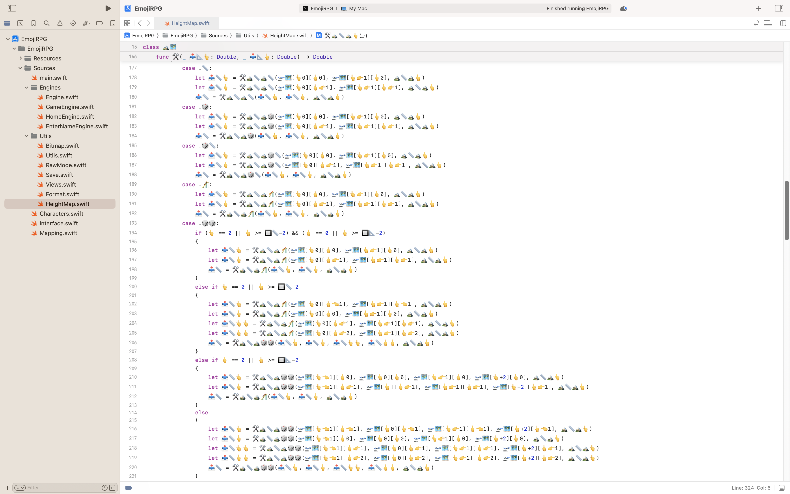

# 😛 Emoji RPG 🤪

A tiny game coded with emojis and displayed with emojis.

Emoji RPG is a tiny game I have developed to practice coding with the Swift language. 
The game just involves walking around a randomly generated map. 

Actually, the real game is not what the program does, but trying to understand the source code. 
As I discovered that Swift supports emojis in variable, function and class names, I thought it would be fun to write a program all in emojis. 🤪 
I've deliberately removed all the comments to make the challenge tougher. 😛 
So I strongly recommend that you consult the source code. It's the most fun part, even if you're not a developer. 

 
Extract from the source code

 

https://github.com/user-attachments/assets/dc3244f6-ba12-4552-8366-fd434f7fe157
